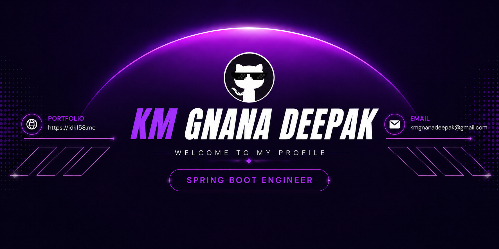

<!--Banner-->

<!--Night Owl image-->

  

#  𝙄'𝙈 𝙂𝙉𝘼𝙉𝘼 𝘿𝙀𝙀𝙋𝘼𝙆!!

*Backend Engineer | Java & Spring Boot Developer*

 

I'm <strong>KM Gnana Deepak</strong>, a <strong>Spring Boot Engineer</strong> passionate about building scalable backend systems, REST APIs, and modern full-stack applications with <strong>Java</strong>, <strong>Spring Boot</strong>, and <strong>React.js</strong>.

- 🚀 Spring Boot • Microservices • Apache Kafka
- 🏗️ Building scalable, production-ready applications
- 📚 Exploring System Design & Backend Architecture
- 🤝 Open to Collaboration & Open Source
- 🌐 Portfolio: **https://idk158.me**
- 📧 Email: **kmgnanadeepak@gmail.com**

  

---

<h2 align="center">Tᴇᴄʜ Sᴛᴀᴄᴋ</h2>

  <picture>
    <source media="(prefers-color-scheme: dark)" srcset="./Skills_Animation_Dark.gif">
    <source media="(prefers-color-scheme: light)" srcset="./Skills_Animation_White.gif">
    
  </picture>

 
<!-- Featured Projects -->
<h2 align="center">Fᴇᴀᴛᴜʀᴇᴅ Pʀᴏᴊᴇᴄᴛs</h2>

<table>
<tr valign="top">

<td width="50%">

### 🌾 KisanSetu
**Multi-Role Agri-Commerce Platform**

A scalable agri-commerce platform built using a microservices architecture with secure authentication, REST APIs, and role-based access for multiple users.

**Tech Stack**

`Spring Boot` `Microservices` `Spring Security` `JWT` `PostgreSQL`

 

</td>

<td width="50%">

### 🏥 SafeFall
**Real-Time Fall Detection System**

A real-time emergency response platform that detects fall incidents, stores events securely, and instantly notifies emergency contacts.

**Tech Stack**

`Spring Boot` `WebSocket` `REST API` `JWT` `PostgreSQL`

 

</td>

</tr>

<tr>

<td colspan="2">

### 🌐 Personal Portfolio

Modern developer portfolio showcasing projects, skills, and experience with a clean UI, responsive design, and smooth animations.

**Tech Stack**

`React` `Tailwind CSS` `TypeScript` `Framer Motion`

 

</td>

</tr>
</table>
 

<h2 align="center">Cᴏɴɴᴇᴄᴛ Wɪᴛʜ Mᴇ </h2>

&nbsp;&nbsp;&nbsp;&nbsp;&nbsp;

&nbsp;&nbsp;&nbsp;&nbsp;&nbsp;

&nbsp;&nbsp;&nbsp;&nbsp;&nbsp;

&nbsp;&nbsp;&nbsp;&nbsp;&nbsp;

&nbsp;&nbsp;&nbsp;&nbsp;&nbsp;

&nbsp;&nbsp;&nbsp;&nbsp;&nbsp;

---

  

